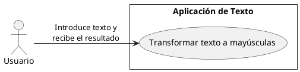
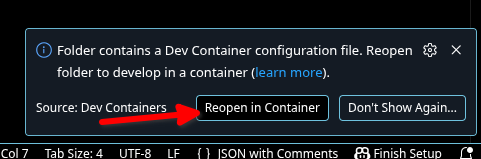

# Ejercicio pasar a mayúsculas

Creación del proyecto usando MVC.

La aplicación le solicita un texto al usuario, y se lo devuelve en mayúsculas.

## Consideraciones técnicas

Esta plantilla usa devcontainer, veremos su explicación en clase con detalle, pero a de forma sencilla es indicarte es como si tuvieses arrancada una máquina virtual con todo el software que necesites y solo pesase 250 MB. Para que te funcione necesitas en tu ordenador el siguiente software:

- VSCode
- Docker

>Nota: JDK, git, maven... todo el software está ya instalado en el `devcontainer`.

### Ejecutar el devcontainer

1. Abre el proyecto clonado con VSCode
2. Detectará que tiene un devcontainer:

Verás que te abre una nueva instancia de VSCode con todo el software (herramientas y extensiones de VSCode) instalado.